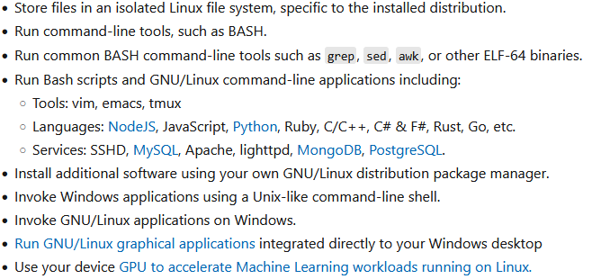

# Understanding the Basic Structure of Good Documentation
While documentation can vary in tone, format, and complexity depending on the project or tool, most good documentation shares a common structure. Recognizing these sections and understanding their purpose can help you quickly find what you need and make sense of unfamiliar tools.

Here are the most common components you're likely to encounter:

## Introduction or Overview
This section gives you a high-level understanding of what the tool or library does. It usually includes:

* A short description of its purpose

* Key features or benefits

* Context about when or why you'd use it

If you're deciding whether a tool is right for your project, this is the place to start.

>## Exercise
>Take a look at the [overview section for WSL's documentation](https://learn.microsoft.com/en-us/windows/wsl/about). Find where the key features or benefits are listed.
><details>
><summary>Solution</summary>
><p>
>
>**Key features or benefits:** 
>
>
></p>
></details> 

## Installation Instructions
This is often one of the first sections you'll look for when getting started. It typically includes:

* System or language requirements

* Step-by-step setup commands (such as `pip install ...`)

* Configuration tips or prerequisites

Clear installation docs help ensure you can get the tool up and running without unnecessary roadblocks.

>## Exercise
>Take a look at [the installation instructions for NumPy](https://numpy.org/install/) and find the steps required to install the package using `conda` or `pip`.
><details>
><summary>Solution</summary>
><p>
>
>**Conda:**
>```bash
>conda create -n my-env
>conda activate my-env
>conda install numpy
>```
>**Pip:**
>```bash
>pip install numpy
>```
>
></p>
></details>

## Getting Started or Quick Start Guide
This section offers a minimal working example to help you see the tool in action. It's designed to:

* Show a basic use case with as little setup as possible

* Let you test that everything is working correctly

* Help you build early confidence in using the tool

Quick starts are especially helpful when you're new to the tool and just want to see how it behaves.

>## Exercise
>Take a look at the section for [getting started using Visual Studio Code with WSL](https://learn.microsoft.com/en-us/windows/wsl/tutorials/wsl-vscode) and find the command required to open a VSCode project from WSL.
>
><details>
><summary>Solution</summary>
><p>
>
>```bash
>code .
>```
>
></p>
></details>

## Usage and Examples
Here, you'll find more detailed instructions on how to use the tool, often with:

* Common code patterns or workflows

* Explanations of options or parameters

* Sample input and output

This section helps you move beyond copy-pasting and start adapting examples to your own needs.

## Function Reference
This is the technical heart of most documentation. It's usually more formal and structured, covering:

* The inputs 

* The outputs

* Example usage

This is where you'll go when you need specifics about how something works.

>## Exercise
>Take a look at the documentation for [numpy's arange module](https://numpy.org/doc/stable/reference/generated/numpy.arange.html) and find the possible inputs (parameters) it can accept.
>
><details>
><summary>Solution</summary>
><p>
>
>* **start**
>
>* **stop**
>
>* **step**
>
>* **dtype**
>
>* **device**
>
>* **like**
>
></p>
></details>

## Troubleshooting or FAQ
Things don't always work the first time. Good documentation includes:

* Common problems and their fixes

* Clarifications on confusing behavior

* Links to support or community resources

This section can save you hours of frustration.

## Glossary/Terminology
For more complex or domain-specific tools, a glossary helps explain jargon or concepts the documentation relies on. Don't skip this. Knowing what a term means can unlock the rest of the documentation.

By learning to identify these sections, you'll be better equipped to scan documentation quickly, understand the scope of a tool, and locate the exact information you need, whether you're just getting started or debugging a complex issue.